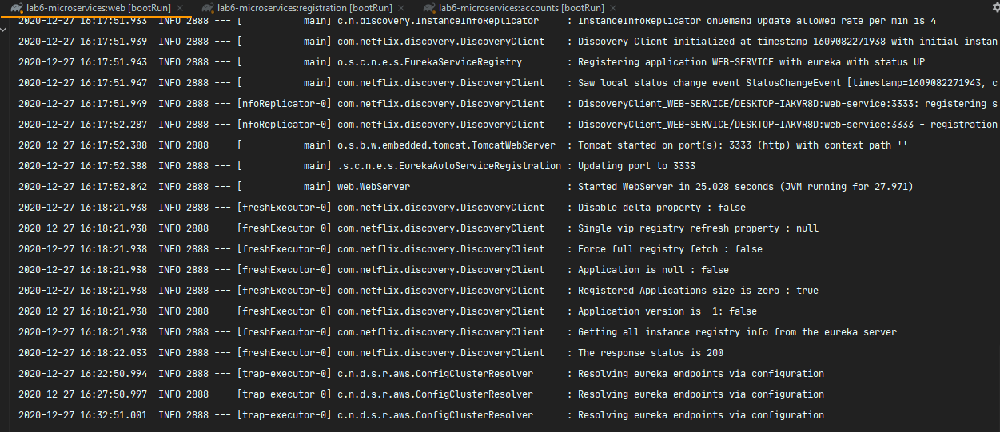
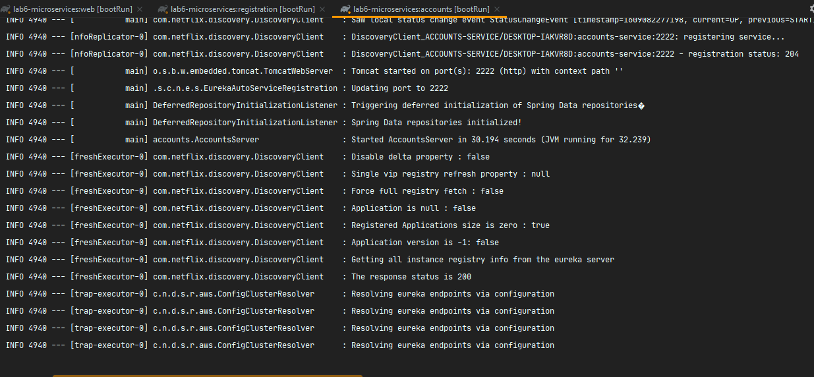
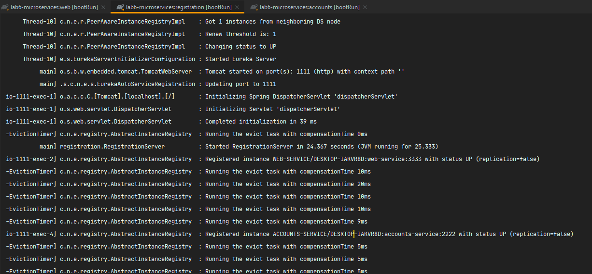
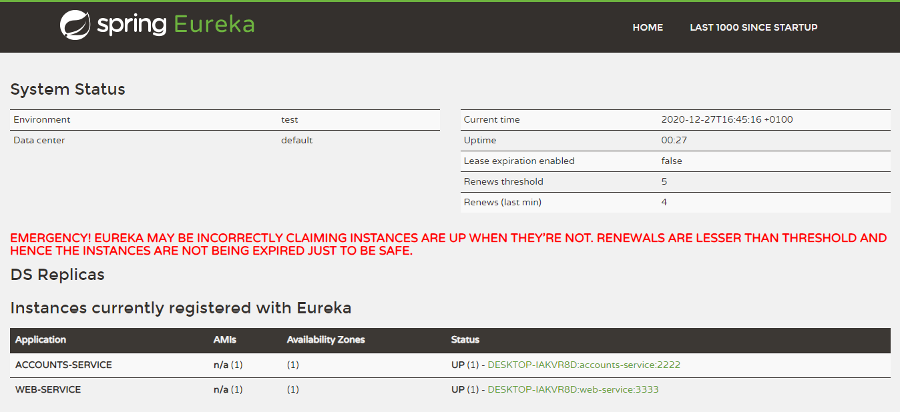
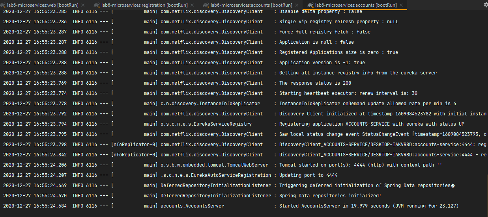
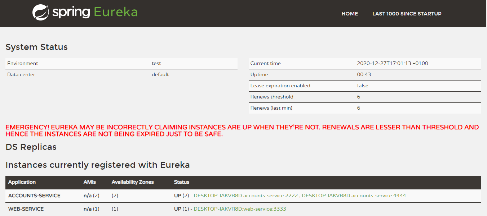
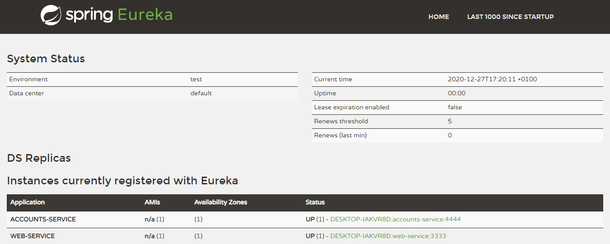
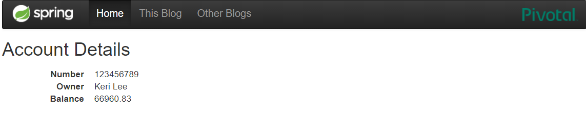
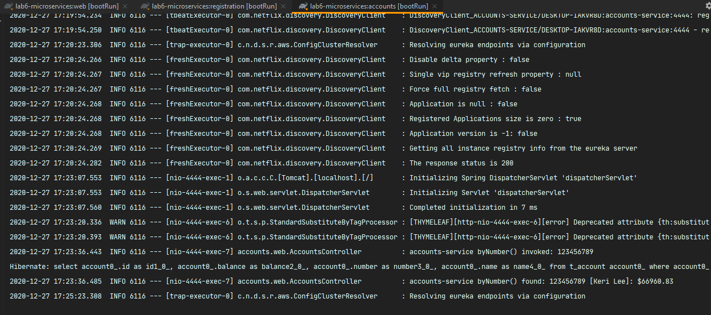

# Laboratory 6: Microservices
**Author: Juan José Tambo Tambo**

First of all, we need to launch 3 services by order (Web, Registration and accounts) with the following commands: 
`gradle :web:bootRun` 
`gradle :registration:bootRun` 
`gradle :accounts:bootRun` 

After that, as we can se, the two microservices are running and registered:

* **Web microservice**: Running on port 3333 

* **Accounts microservice**: Running on port 2222 

On the _Registration_ service terminal, we can se that _Accounts_ and _Web_ microservices are registered: 

Once all services are running and registered, we can access to the _Eureka_ dashborad on `http://localhost:1111`. We can
check that there is only 1 accounts instance registered (accounts-service):

## Running a second accounts instance
Now, we need to add another accounts instance on the port 4444. First of all, we modify the file 
`accounts/src/main/resources/application.yml`. On the tag _port_, replace 2222 with 4444. Then, run the instance with 
`gradle :accounts:bootRun`.

If we access to the _Eureka_ dashboard, we can verify that the second accounts instance is registered.

Now, if the client makes a petition to the server, only one of the two instances will reply. This is due to the 
client-side load balancer, that divides the petitions between the two accounts instances. 

If we kill the `accounts` instance that is hosted on the port 2222, only the instance hosted on the port 4444 will reply
petitions. On the _Eureka_ dashboard there is only one `accounts` instance:

If we make a petition to `http://localhost:3333/accounts/123456789`, the server will reply normally:

And we can see on the `accounts` instance LOG that `SQL sentences` has been invoked due to the request.

So if we kill one `accounts` instance, there will be no errors because the client has a `load balancer` that 
queries _Eureka_ the _IP_ from `accounts-service` service.

